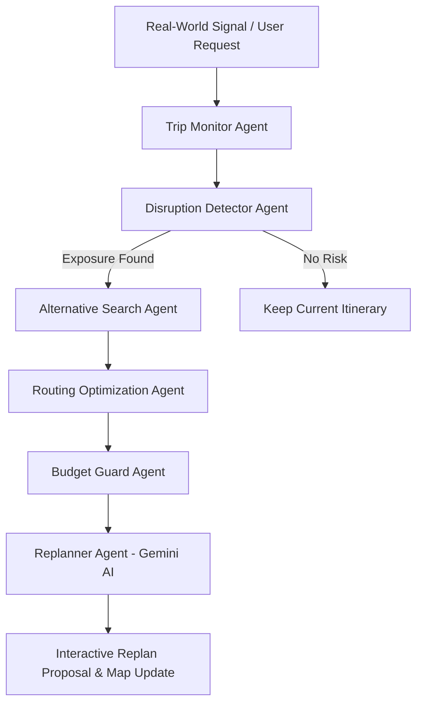

# 🌍 Wayvia — Autonomous Agentic Travel Intelligence Platform

> **Submitted for DoraHacks 2.0 Hackathon**  
> **Team Name:** ZENITH  
> **Team Members:** Renu Kumari Prajapati & Stuti Tiwari  

[](https://nextjs.org/)
[](https://www.typescriptlang.org/)
[](https://tailwindcss.com/)
[](https://deepmind.google/technologies/gemini/)
[](https://leafletjs.com/)

---

## 📋 Table of Contents
- [📌 Executive Summary](#-executive-summary)
- [🚀 Key Features & Capabilities](#-key-features--capabilities)
- [🏗️ Multi-Agent System Architecture](#️-multi-agent-system-architecture)
- [🛠️ Tech Stack & Technologies](#️-tech-stack--technologies)
- [📁 Repository Structure](#-repository-structure)
- [⚡ Quick Start & Setup Guide](#-quick-start--setup-guide)
- [🧪 Hackathon Demo Guide](#-hackathon-demo-guide-for-judges--evaluators)
- [🛣️ Future Roadmap](#️-future-roadmap)
- [👥 Team & Hackathon Details](#-team--hackathon-details)

---

## 📌 Executive Summary

Traditional travel planners are **static**. Once an itinerary is generated as a PDF or calendar invite, it fails the moment real-world disruptions strike — whether it's an unexpected rainstorm, flight delay, transit strike, or sudden venue closure.

**Wayvia** is an **autonomous, agentic travel intelligence platform** that continuously monitors live travel conditions, detects friction points before they ruin a trip, and automatically re-synthesizes optimized alternative itineraries in real-time. Powered by Google Gemini AI and multi-agent decision architecture, Wayvia shifts 
---

## 🚀 Key Features & Capabilities

- 🤖 **Agentic Multi-Step Re-Planning Engine**
  - Continuous trip health evaluation based on live weather, route constraints, and user preferences.
  - Multi-agent workflow: *Trip Monitor*, *Disruption Detector*, *Alternative Search*, *Routing Engine*, *Budget Guard*, and *Replanner*.

- 🌦️ **Interactive Disruption Sandbox**
  - Simulate real-world travel emergencies (e.g., Heavy Rainstorm, 3-hour Flight Delay, Subway Transit Strike).
  - Watch the multi-agent AI engine stream step-by-step reasoning and generate instant adaptive proposals.

- 🗺️ **Dynamic Geospatial Mapping**
  - Built with Leaflet.js & OpenStreetMap.
  - Interactive activity pins, route polylines, distance metrics, and live recalculations upon itinerary shifts.

- 📊 **Real-Time Trip Health & Risk Metrics**
  - Dynamic score calculating weather risk, transit reliability, and safety alerts.
  - Granular budget breakdown with instant price delta verification for proposed activity swaps.

- 🧙‍♂️ **Multi-Constraint Trip Generation Wizard**
  - Customizable trip planning supporting travel pace (Relaxed vs Packed), budget ranges, interests (Culture, Food, Adventure, Nature), and travel style.

---

## 🏗️ Multi-Agent System Architecture

Wayvia uses a modular agent pipeline where specialized sub-agents collaborate to maintain trip integrity:



### Sub-Agent Breakdown:
1. **Trip Monitor Agent**: Ingests live meteorological feeds and transit updates.
2. **Disruption Detector Agent**: Evaluates outdoor activity vulnerability against environmental hazards.
3. **Alternative Search Agent**: Finds indoor/nearby cultural alternatives matching traveler preferences.
4. **Routing Engine Agent**: Recalculates travel times and optimizes transport trajectories.
5. **Budget Guard Agent**: Verifies cost implications to guarantee the trip stays within budget limits.
6. **Replanner Agent (Gemini AI)**: Synthesizes a cohesive, context-aware alternative itinerary with plain-English rationales.

---

## 🛠️ Tech Stack & Technologies

| Layer | Technology |
|---|---|
| **Framework** | Next.js 14 (App Router) |
| **Language** | TypeScript 5.0 |
| **Styling & UI** | Tailwind CSS, Lucide React Icons, Glassmorphism Design System |
| **AI Integration** | Google Gemini API (with robust autonomous fallback engine) |
| **Mapping & Spatial** | Leaflet.js, React-Leaflet, OpenStreetMap |
| **State Management** | React Context API with LocalStorage reactive persistence |
| **Animations** | Canvas Confetti, Tailwind Animations |

---

## 📁 Repository Structure

```text
Wayvia/
├── app/
│   ├── api/             # Next.js API Routes (Gemini AI proxy, services)
│   ├── dashboard/       # Main Travel Dashboard (Itinerary, Map, Health, Budget)
│   ├── plan/            # Multi-step Trip Planning Wizard
│   ├── globals.css      # Design tokens, keyframe animations, glassmorphism
│   ├── layout.tsx       # Root layout with TripProvider & navigation
│   └── page.tsx         # Modern landing page & product showcase
├── components/
│   ├── ai/              # AI Re-plan Modals & Agent Thinking Overlay
│   ├── alerts/          # Live Disruption Alert Banners & Warnings
│   ├── brand/           # Wayvia Logo & Brand Assets
│   ├── dashboard/       # Weather Cards, Health Index, Budget Tracker
│   ├── itinerary/       # Interactive Day-by-Day Timeline
│   ├── landing/         # Landing Hero, Features, Destinations & Blog
│   ├── layout/          # Navbar & Footer
│   ├── map/             # Leaflet OSM Interactive Map Components
│   └── plan/            # Plan Wizard & Quick Plan Modal
├── lib/
│   ├── ai/              # Core Agentic Engines (planner, replanner, monitor, etc.)
│   ├── demo/            # Preset travel scenarios & disruption demo data
│   ├── services/        # External weather, place, & routing service integrations
│   └── store/           # Global Trip State Context (tripStore.tsx)
├── types/               # TypeScript interface definitions (trip.ts, agent.ts)
├── .env.example         # Environment variable template
├── next.config.mjs      # Next.js configuration
├── package.json         # Project metadata and dependencies
└── tailwind.config.ts   # Custom Tailwind theme & color tokens
```

---

## ⚡ Quick Start & Setup Guide

### Prerequisites
- **Node.js**: `v18.x` or later
- **npm**: `v9.x` or later

### Installation

1. **Clone the repository:**
   ```bash
   git clone https://github.com/.../Wayvia.git
   cd Wayvia/Wayvia
   ```

2. **Install dependencies:**
   ```bash
   npm install
   ```

3. **Configure Environment Variables:**
   Copy `.env.example` to create `.env.local`:
   ```bash
   cp .env.example .env.local
   ```
   *Edit `.env.local` with your API keys (Optional - fallback autonomous mode works out-of-the-box):*
   ```env
   # Google Gemini API Key (Optional)
   GEMINI_API_KEY=your_gemini_api_key_here

   # Google Maps API (Optional: Leaflet OSM used by default)
   NEXT_PUBLIC_GOOGLE_MAPS_API_KEY=your_google_maps_key_here
   ```

4. **Run the Development Server:**
   ```bash
   npm run dev
   ```

5. **Open Application:**
   Navigate to [http://localhost:3000](http://localhost:3000) in your browser.

---

## 🧪 Hackathon Demo Guide (For Judges & Evaluators)

To test the core innovation of **Wayvia** during judging:

1. **Explore the Landing Page**: Click **"Plan My Trip"** or **"Explore Demo Dashboard"**.
2. **Access the Dashboard**: Notice the live itinerary timeline (Day 1 - Day 5), interactive Leaflet map, Trip Health Score (100%), and Weather widget.
3. **Trigger Disruption Sandbox**:
   - In the top action bar or Disruption Banner, click **"Simulate Disruption"** -> **"Heavy Rainstorm"** (or Flight Delay / Transit Strike).
   - Watch the **Agent Thinking Overlay** stream live agent steps (Weather check ➔ Exposure analysis ➔ Indoor alternative search ➔ Route optimization ➔ Budget check ➔ AI Synthesis).
4. **Review Re-Plan Proposal**:
   - Inspect the side-by-side comparison (e.g., Outdoor park walking tour replaced with an indoor Art Museum & Covered Arcade).
   - Click **"Accept Proposal"** to watch the itinerary and Leaflet map update in real-time with confetti feedback!

---

## 🛣️ Future Roadmap

- 📱 **Mobile Native App (React Native / PWA)**: Offline-first cached itineraries with GPS background monitoring.
- ✈️ **Direct GDS & Airline API Integration**: Automated flight rebooking via Amadeus & Sabre APIs.
- 👥 **Collaborative Group Travel Agent**: Multi-user voting & real-time preference conflict resolution.
- 💳 **Automated Expense Compensation**: Instant claims trigger for delayed flights or cancelled bookings.

---

## 👥 Team & Hackathon Details

- **Hackathon:** DoraHacks 2.0
- **Team Name:** ZENITH
- **Team Members:**
  - 👩‍💻 **Renu Kumari Prajapati**
  - 👩‍💻 **Stuti Tiwari**

---

<p align="center">
  <i>Built with ❤️ by Team ZENITH for DoraHacks 2.0</i>
</p>
